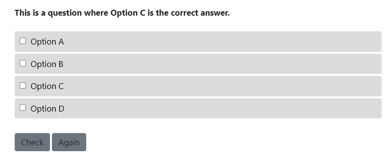
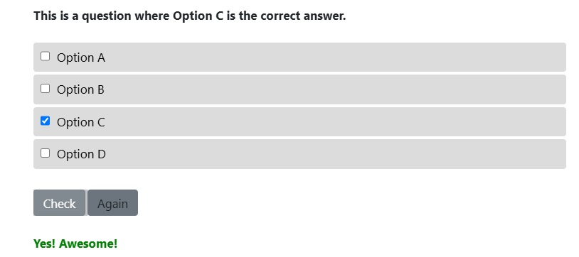

# quartolive_exercise

Includes two templates to be used with quarto-live (live-html format).
Unfortunately I could not make any of the existing tools work with this format as to include interactive multiple choice questions.
Therefore I created a custom solution using mostly ojs.

**template_mc1.qmd** mostly uses ojs obersavle input but does not always behave as expected regarding the buttons.
After hitting the check button the output message is updated continuously.
The again button does not reset the checkbox fields, only prevents the outpt message.

**template_mc2.qmd** mostly uses traditional html input and an ojs obervable button.
Features some additional styling and a fully working reset button. The code is longe but I much prefer this solution.

The following Screenshots show the result of my second solution: **template_mc2.qmd**

This is my first time actively using ojs (and JavaScript) so it's probably not very elegant but gets the job done.
